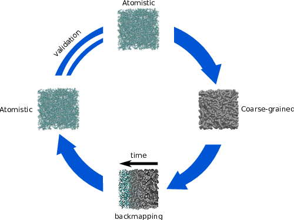

.. Baker documentation master file, created by
   sphinx-quickstart on Wed Sep  2 23:23:37 2015.
   You can adapt this file completely to your liking, but it should at least
   contain the root `toctree` directive.

#######################
Documentation of bakery
#######################

Baker is a general purpose reverse mapping tool that allows to
transform your coarse-grained coordinate file to atomistic representation.

.. toctree::
   :maxdepth: 3

   method
   settings
   commands
   workflow
   genindex
   modindex
