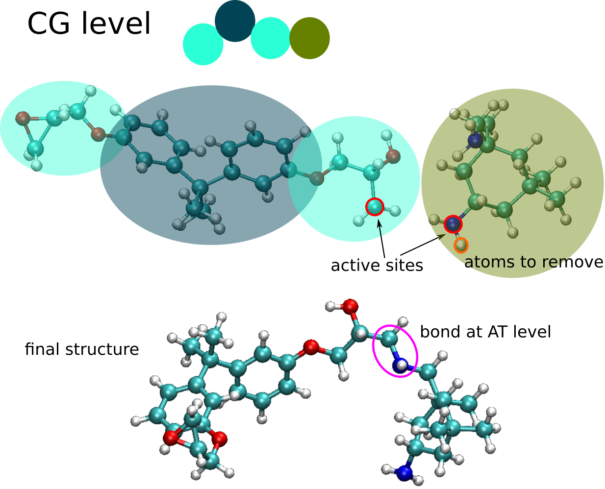

.. role:: xml(code)
   :language: xml

.. role:: python(code)
   :language: python

###################
Configuration file
###################

The description of backmapping configuration is stored in XML file format. The format of file is very similarly
to what is used by VOTCA_. In next two examples we will explain step-by-step how to create that file.

.. toctree::
   :maxdepth: 3

   xml_structure

Dodecane
========

The original VOTCA_ mapping file is shown below. It represents mapping where two united-atoms are replaced by the one coarse-grained bead.

.. code-block:: xml

  <cg_molecule>
  <name>DOD</name> <!-- the name of the molecule after mapping -->
  <ident>DOD</ident> <!-- the name of the molecule in atomistic topology --> 
  <topology>
    <cg_beads>
      <cg_bead>
        <name>A1</name>
        <type>A</type>
        <mapping>A</mapping>
        <beads>
          1:DOD:C1 1:DOD:C2
        </beads>
      </cg_bead>
      <cg_bead>
        <name>B1</name>
        <type>B</type>
        <mapping>B</mapping>
        <beads>
          1:DOD:C3 1:DOD:C4
        </beads>
      </cg_bead>
      <cg_bead>
        <name>B2</name>
        <type>B</type>
        <mapping>B</mapping>
        <beads>
          1:DOD:C5 1:DOD:C6
        </beads>
      </cg_bead>
      <cg_bead>
        <name>B3</name>
        <type>B</type>
        <mapping>B</mapping>
        <beads>
          1:DOD:C7 1:DOD:C8
        </beads>
      </cg_bead>
      <cg_bead>
        <name>B4</name>
        <type>B</type>
        <mapping>B</mapping>
        <beads>
          1:DOD:C9 1:DOD:C10
        </beads>
      </cg_bead>
      <cg_bead>
        <name>A2</name>
        <type>A</type>
        <mapping>A</mapping>
        <beads>
          1:DOD:C11 1:DOD:C12
        </beads>
      </cg_bead>
    </cg_beads>
    <cg_bonded>
      <bond>
        <name>bond</name>
        <beads>
          A1 B1
          A2 B4
          B1 B2
          B2 B3
          B3 B4
        </beads>
      </bond>
      <angle>
        <name>angle_ch3</name>
        <beads>
          A1 B1 B2
          B3 B4 A2
        </beads>
      </angle>
      <angle>
        <name>angle_ch2</name>
        <beads>
          B1 B2 B3
          B2 B3 B4
        </beads>
      </angle>
      <dihedral>
        <name>dihedral</name>
        <beads>
          A1 B1 B2 B3
          B1 B2 B3 B4
          B2 B3 B4 A2
        </beads>
      </dihedral>
    </cg_bonded>
  </topology>
  <maps>
    <map>
      <name>A</name>
      <weights>15.035 14.027</weights>
    </map>
    <map>
      <name>B</name>
      <weights>14.027 14.027</weights>
    </map>
  </maps>
  </cg_molecule>

`<settings>`
+++++++++++++++

First we have to surround whole file with :xml:`<settings>` tag:

.. code-block:: xml

  <settings>
    <cg_molecule>
    ...
    </cg_molecule>
  </settings>

`<cg_molecule>`
++++++++++++++++++

Next, we have to set up source coordinate file for each of molecule. We add tag :xml:`<source_file>` and :xml:`<source_topology>`
which defines topology of atomistic fragment.

.. code-block:: xml

    <cg_molecule>
      ...
      <source_coordinate><file>dodecane_single.gro</file></file></source_coordinate>
      <source_topology><file>topol.top</file></source_topology>
      ...
    </cg_molecule>

There could be multiple :xml:`<cg_molecule>` sections that will describe different types of atomistic molecule.

`<cg_configuration>`
+++++++++++++++++++++++++

After the list of CG molecules, we have to define
input format and a name of file of CG coordinate file that is reverse mapped.

.. code-block:: xml

  <cg_molecule>
  ...
  </cg_molecule>

  <cg_configuration>
    <coordinate>cg_conf.gro</coordinate>
    <topology>cg_topol.top</topology>
  </cg_configuration>
  ...

`<hybrid_configuration>`
++++++++++++++++++++++++++

This section describes output hybrid coordinate file. Currently we support only GROMACS output file.

.. code-block:: xml
  
  <hybrid_configuration>
    <file>hyb_conf.gro</file>
  </hybrid_configuration>

In this block above we define that the output hybrid coordinate file will be stored in `hyb_conf.gro`.

`<hybrid_topology>`
+++++++++++++++++++++++++++

The options for output hybrid topology file are defined in tag :xml:`<hybrid_topology>`. Very simple example is shown below.

.. code-block:: xml

  <hybrid_topology>
    <file>hyb_topol.top</file>
    <include>
      #include "/usr/share/gromacs/top/oplsaa.ff/forcefield.itp"
    </include>
    <molecule_type>
        <name>PE</name>
        <exclusion>3</exclusion>
    </molecule_type>
    <system>PE</system>
  </hybrid_topology>

Here we define that output file is `hyb_topol.top`. We define include section in :xml:`<include></include>`. :xml:`<molecule_type>` tag defines the name of molecule in `<name>` tag and the exclusion rule. In this case, every particle that is separated by 1, 2, 3 bonds will be excluded from non-bonded interactions. This follows the GROMACS_ rules (see `GROMACS manual`_ for further information).

Network backmapping
===================

This example is based on backampping of epoxy-like network, built with two components:
bisphenol A diglycidyl ether and isophrone diamine.
Full settings can be found in :download:`settings_network.xml <settings_rim135.xml>`.
Here we only denote important sections.

`<source_coordinate>` and `<source_topology>`
+++++++++++++++++++++++++++++++++++++++++++++
.. code-block:: xml

  <source_coordinate>
      <file molecule_degree="0">epon-828.gro</file>
      <file molecule_degree="1" when="A1">epon-828_deg1_A1.gro</file>
      <file molecule_degree="1" when="A2">epon-828_deg1_A2.gro</file>
      <file molecule_degree="2">epon-828_deg2.gro</file>
  </source_coordinate>

`source_coordinate` and `source_topology` defines the atomistic fragments to use.
The appropriate file is selected depends on the molecule degree and the connected coarse-grained
bead.
In this case, the epoxied molecule is coarse-grained into three beads `A1-B1-A2`.
During the chemical reaction, either `A1` or `A2` can be linked to other molecules and base on this
the appropriate fragment will be selected.
The same structure is in the case of `source_topology`.

`<cg_bead>`
+++++++++++

.. code-block:: xml

   <cg_bead>
       <name>A1</name>
       <type>A</type>
       <beads degree="1" molecule_degree="0">
           1:EPO:C1 1:EPO:O1 1:EPO:C2 1:EPO:H1 1:EPO:H2 1:EPO:H3 1:EPO:C3 1:EPO:O2 1:EPO:H23 1:EPO:H24
       </beads>
       <beads degree="2" active_site="EPO:C1:4" molecule_degree="1,2">
           1:EPO:C1 1:EPO:O1 1:EPO:C2 1:EPO:H1 1:EPO:H2 1:EPO:H3 1:EPO:C3 1:EPO:O2 1:EPO:H23 1:EPO:H24
           1:EPO:H25
       </beads>
   </cg_bead>

Here we put the list of atoms that will be taken from the fragment (with bonds, angles, dihedrals).
We can define multiple bead lists that will vary with **degree** and **molecule_degree**.

If the bead at CG level is reactive then we have to define an **active_site**, the atoms from the bead
that will be use to make a connection at atomistic level.
The concept of active sites is illustrated below:

`<charge_map>`
--------------

The partial charges for the atoms can be defined in the input topology file or at the level of :xml:`<beads>` tag by
including :xml:`<charge_map></charge_map>` tag.

.. code-block:: xml

  <beads degree="1" molecule_degree="0">
      1:EPO:C1 1:EPO:O1 1:EPO:C2 1:EPO:H1 1:EPO:H2 1:EPO:H3 1:EPO:C3 1:EPO:O2 1:EPO:H23 1:EPO:H24
      <charge_map>
      0.0 0.0 * * * * * * * *
      </charge_map>
  </beads>

The number of elements in the charge map has to correspond number of atoms in the fragment.
We can define explicitly the particla charge for atom or we can declare that the charge for this atom
will be taken from the topology by using star character *****.

The charges per fragment can be equilibrated by definigin the attribute :xml:`equilibrate_charges="1"` in :xml:`<cg_molecule>` tag:

.. code-block:: xml

  <cg_molecule equilibrate_charges="1">
    ...

**References**

.. target-notes::

.. _VOTCA: http://votca.org/
.. _GROMACS: http://www.gromacs.org/
.. _LAMMPS: http://lammps.sandia.gov/
.. _data file: http://lammps.sandia.gov/doc/2001/data_format.html
.. _input files: http://lammps.sandia.gov/doc/99/input_commands.html
.. _GROMACS manual: http://www.gromacs.org/Documentation/Manual
